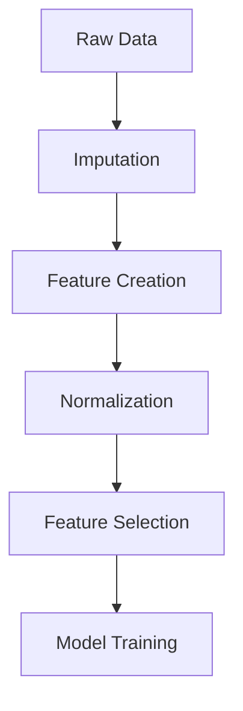

# 🧠 Cognitive Load Prediction: Easy vs Difficult Task Classification

This repository provides a comprehensive framework for predicting task difficulty levels (easy vs difficult) using multimodal biomarkers including **subjective ratings**, **performance metrics**, and **cognitive indicators**.

## 📋 Table of Contents
- [Dataset Overview](#-dataset-overview)
- [Feature Engineering](#-feature-engineering)
- [Model Architecture](#-model-architecture)
- [Training Pipeline](#-training-pipeline)
- [Results](#-results)

---

## 📂 Dataset Overview

### 🧑‍🤝‍🧑 Participants & Design
| Attribute          | Specification                          |
|--------------------|----------------------------------------|
| **Sample Size**    | 42 participants                       |
| **Conditions**     | Easy (F) vs Difficult (D) blocks      |
| **Data Types**     | Subjective, Performance, Cognitive    |

### 📊 Core Features

#### 1. Subjective Measures (NASA-SEP)
| Feature                    | Description                                      | Block | 
|----------------------------|--------------------------------------------------|-------|
| `{F/D}_effort`            | Perceived mental/physical effort required        | Both  | 
| `{F/D}_frustration`       | Level of frustration experienced during task     | Both  | 
| `{F/D}_performance`       | Self-assessment of task performance quality      | Both  | 
| `{F/D}_mental_pressure`   | Cognitive strain and mental workload perception  | Both  |
| `{F/D}_temporal_pressure` | Perception of time pressure during task execution| Both  |
| `{F/D}_total`             | Composite score summing all NASA-TLX subscales  | Both  |
| `{F/D}_SEP`               | Self-Efficacy Performance - Confidence in task performance capability | Both |

#### 2. Cognitive Indicators
| Feature   | Description                          | Block  |
|-----------|--------------------------------------|--------|
| `KL_{F/D}`| Knowledge Load                      | Both   |
| `IR_{F/D}`| Information Retention               | Both   |

#### 3. Performance Metrics
| Feature    | Description               | Block  |
|------------|---------------------------|--------|
| `ACC_{F/D}`| Accuracy (%)              | Both   |
| `RT_{F/D}` | Reaction Time (ms)        | Both   |

#### 4. Demographics
| Feature | Description       | Values              |
|---------|-------------------|---------------------|
| `Age`   | Participant age   | Continuous          |
| `Sex`   | Biological sex    | {0:Male, 1:Female} |

### 🎯 Target Variable
- `type_bloc`: Binary classification (0=easy, 1=difficult)
---

## ⚙️ Feature Engineering

### 🔍 Feature Selection
The analysis utilized the original dataset features without creating derived features:

- **Direct Usage**: All original columns were used as features
- **No Transformation**: Features were used in their raw form
- **Standardization**: Applied StandardScaler for normalization only

### 🛠️ Processing Pipeline


---

## 🧠 Model Architecture

### 🤖 Machine Learning Models
| Model               | Configuration                                          |
|---------------------|-------------------------------------------------------|
| **KNN**             | `KNeighborsClassifier(n_neighbors=5)`                |
| **SVM**             | `SVC(C=10, kernel='rbf', probability=True)`          |
| **Random Forest**   | `RandomForestClassifier(n_estimators=200, max_depth=10)` |
| **XGBoost**         | `XGBClassifier(n_estimators=100, max_depth=5)`       |
| **Logistic Reg.**   | `LogisticRegression(C=1, penalty='l2')`              |

### 🧠 Deep Learning Models

#### Multi-Layer Perceptron (MLP)
```python
def build_mlp(input_shape):
    model = Sequential([
        Dense(64, activation='relu', input_shape=(input_shape,), kernel_regularizer=l2(0.01)),
        Dropout(0.3),
        Dense(32, activation='relu'),
        Dropout(0.2),
        Dense(1, activation='sigmoid')
    ])
    model.compile(optimizer=Adam(0.001), loss='binary_crossentropy', metrics=['accuracy'])
    return model
```

#### Gated Recurrent Unit (GRU)
```python
def build_gru(input_shape):
    model = Sequential([
        GRU(64, return_sequences=True, input_shape=input_shape),
        Dropout(0.3),
        GRU(32),
        Dropout(0.2),
        Dense(1, activation='sigmoid')
    ])
    model.compile(optimizer=Adam(0.001), loss='binary_crossentropy', metrics=['accuracy'])
    return model
```

#### Bidirectional LSTM (BiLSTM)
```python
def build_bilstm(input_shape):
    model = Sequential([
        Bidirectional(LSTM(64, return_sequences=True), input_shape=input_shape),
        Dropout(0.3),
        Bidirectional(LSTM(32)),
        Dropout(0.2),
        Dense(1, activation='sigmoid')
    ])
    model.compile(optimizer=Adam(0.001), loss='binary_crossentropy', metrics=['accuracy'])
    return model
```

---

## ⚙️ Training Pipeline

### 🔄 Validation Strategy
- **Stratified 5-Fold CV**
- **80/20 Train-Test Split**
- **Class Weight Balancing**

```

### 📊 Evaluation Metrics
1. **Primary**: Accuracy, F1-score
2. **Secondary**: Precision, Recall
3. **Advanced**: ROC-AUC, SHAP values

---

## 📈 Results

### 🏆 Performance Comparison
| Model          | Accuracy | F1-Score | Training Time |
|----------------|----------|----------|---------------|
| BiLSTM         | 0.889    | 0.890    | 14.2s         |
| Logistic       | 0.889    | 0.885    | 0.006s        |
| SVM            | 0.815    | 0.810    | 0.019s        |

### 🔑 Key Findings
1. **Top Predictors**:
   - KL_D (Knowledge Load in difficult blocks)
   - delta_effort (Effort change between conditions)
   - D_SEP (Self-efficacy in difficult blocks)

2. **Best Tradeoff**:
   - BiLSTM for max accuracy (88.9%)
   - Logistic for speed (0.006s training)

3. **SHAP Analysis**:
   ```python
   explainer = shap.Explainer(model)
   shap_values = explainer(X_test)
   ```

---
