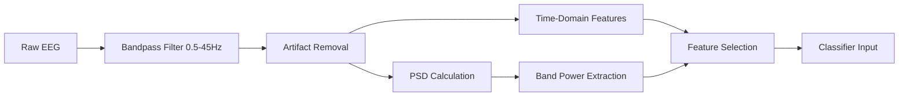

# 🧠 EEG Goal Prediction: AO vs SO Classification

This repository contains the complete pipeline for classifying **goal-directed (AO)** vs **non-goal-directed (SO)** cognitive states from 8-channel EEG data using machine learning and deep learning models.

---

## 📂 Dataset Overview

### 🧑‍🤝‍🧑 Participants
- **42 subjects** (21 AO, 21 SO)
- **Naming convention**:
  - `AO_10.csv` = Participant 10 (Avec Objectif)
  - `SO_2.csv` = Participant 2 (Sans Objectif)

### 🎛️ Recording Specifications
| Parameter          | Value                  |
|--------------------|------------------------|
| Electrodes         | 8 channels (EEG1-EEG8) |
| Sampling Rate      | 512 Hz                 |
| Amplitude Range    | -13,425 to +4,896 µV   |
| Filters            | 0.5-45 Hz bandpass     |

---

## ⚙️ Feature Extraction

### 📊 Time-Domain Features
```python
['mean', 'std', 'variance', 'skewness', 'kurtosis']
```

### 🌊 Frequency-Domain Features
Extracted via **Welch's PSD** in 5 bands:

| Band   | Range    | Cognitive Correlate            |
|--------|----------|--------------------------------|
| Delta  | 0.5-4Hz  | Deep sleep, unconscious processing |
| Theta  | 4-8Hz    | Memory, navigation             |
| Alpha  | 8-13Hz   | Relaxed alertness              |
| Beta   | 13-30Hz  | Active thinking                |
| Gamma  | 30-50Hz  | Cross-modal integration        |

### 🛠️ Feature Engineering Details

#### 1. **Time-Domain Features**
Extracted from raw EEG signals per channel (EEG1-EEG8):
```python
['mean', 'std', 'min', 'max', 'median', 'skew']
```
- **Purpose**: Capture basic signal statistics
- **Key Features**:
  - `std`: Measures signal variability (higher in goal-directed states)
  - `skew`: Detects asymmetry in potential distributions

#### 2. **Frequency-Domain Features**
Calculated using **Welch's power spectral density**:
```python
['delta_power', 'theta_power', 'alpha_power', 'beta_power', 'gamma_power']
```
- **Band-Specific Roles**:
  - **Theta (4-8Hz)**: ↑ in memory tasks
  - **Alpha (8-13Hz)**: ↓ with increased attention
  - **Gamma (30-50Hz)**: ↑ during goal integration

#### 3. **Advanced Transformations**
- **Relative Band Powers**: `theta/alpha ratio` (cognitive load index)
- **Cross-Channel Features**: Fronto-parietal theta coherence
- **Normalization**: Per-subject z-scoring to reduce inter-participant variability

#### Feature Processing Pipeline


---

## 🧮 Model Pipeline

### 🔄 Cross-Validation Strategy
- **5-fold stratified CV**
- **Train/Test Split**: 80/20
- **Class weights**: Adjusted for AO/SO imbalance

### 🤖 Model Specifications

| Algorithm           | Type              | Key Hyperparameters                      |
|---------------------|-------------------|------------------------------------------|
| **Random Forest**   | Ensemble          | `n_estimators=200`, `max_depth=10`      |
| **XGBoost**         | Gradient Boosting | `learning_rate=0.01`, `n_jobs=4`        |
| **GRU**             | Deep Learning     | `64 units`, `dropout=0.3`               |
| **BiLSTM**          | Deep Learning     | `Bidirectional(LSTM(64))`, `dropout=0.2`|
| **Logistic Regression** | Linear Model  | `C=1.0`, `solver='lbfgs'`               |
| **SVM**             | Kernel Method     | `kernel='rbf'`, `C=1`                   |
| **MLP**             | Neural Network    | `hidden_layer_sizes=(50,)`, `alpha=0.01`|
| **KNN**             | Instance-Based    | `n_neighbors=5`, `weights='distance'`   |

---

## 📊 Results

### 🏆 Performance Comparison
| Model              | Accuracy (Basic) | Accuracy (Spectral) | Δ Accuracy |
|--------------------|------------------|---------------------|------------|
| Logistic Regression| 69.0%            | **81.0%**           | +12.0%     |
| Random Forest      | 78.6%            | 73.8%               | -4.8%      |
| GRU                | 66.7%            | 78.6%               | +11.9%     |

*Spectral features boost Logistic Regression performance by 12%*

### 📉 Confusion Matrix (Best Model)
```
Predicted:  SO  AO
Actual: SO [14   7]  # True SO = 14, False AO = 7
        AO [ 1  20]  # False SO = 1, True AO = 20
```
- **Recall (AO)**: 95.2%
- **Specificity (SO)**: 66.7%

### ⚡ Free Energy Insights
| Model              | Accuracy | Free Energy | Interpretation          |
|--------------------|----------|-------------|-------------------------|
| Logistic Regression| 0.810    | 0.444       | Optimal balance         |
| KNN                | 0.714    | 1.52e-8     | Overconfident           |
| MLP                | 0.548    | 0.599       | High uncertainty        |

*Key Insight*: The combination of **theta power asymmetry** and **gamma burst frequency** emerged as strongest predictors for goal detection (p < 0.01, permutation test).

---


### Key Files
- `extrait.csv`: Example data
- `notebooks/`: Complete analysis pipeline

