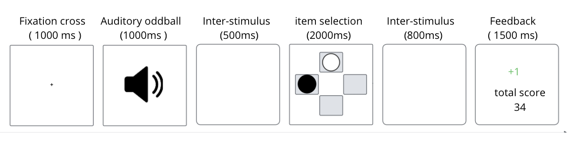

# Machine Learning-Based EEG Biomarkers of Adaptive Behavior Under Motivational Load

## 🧠 Overview

This project develops machine learning-based EEG biomarkers to analyze cognitive flexibility under motivational load. We employ an innovative dual-task paradigm combining probabilistic reversal learning with auditory oddball detection to study behavioral adaptation in dynamic environments.

## 🎯 Study Objective

This research aims to *develop and validate EEG biomarkers to characterize cognitive flexibility under motivational load* using machine learning approaches. The study examines how specific goal constraints modulate adaptive brain and behavioral processes during complex cognitive tasks.

## 🔄 Modeling Pipeline

Our methodology follows a sequential approach with *two distinct phases* to capture different aspects of cognitive adaptation:

### Phase 1: Group Classification
*Objective*: Predict participant category (AO vs SO) from EEG signals

- *Target Variable*: Group membership
  - *AO (With Goal)*: Participants with specific performance objectives
  - *SO (Without Goal)*: Participants with general instructions
- *Input Data*: Spectral EEG features (theta, beta, alpha, gamma bands) - *See EEG_Dataset/ for detailed variables*
- *Approach*: Supervised classification with cross-validation
- *Target Performance*: >80% classification accuracy

### Phase 2: Difficulty Classification
*Objective*: Predict block complexity (easy vs difficult) from comprehensive subjective measures

- *Target Variable*: Block complexity level
  - *Easy*: Blocks with 85%/15% contingencies (gain/loss)
  - *Difficult*: Blocks with 75%/25% contingencies (gain/loss)
- *Input Data*: Subjective measures and behavioral indicators - *See Comportemental_Dataset/ for detailed variables*
  - NASA-TLX scales (cognitive load, frustration, effort)
  - Self-efficacy measures (SEP)
  - Behavioral performance indices
- *Approach*: ML/DL models with interpretability analysis
- *Target Performance*: >85% prediction accuracy

### Research Questions by Phase

*Phase 1 - Group Classification:*
- *RQ1*: Can spectral EEG features reliably differentiate WG vs WOG cognitive states?
- *RQ2*: Comparative performance of statistical vs spectral features
- *RQ3*: Optimal algorithms for accuracy/efficiency balance

*Phase 2 - Difficulty Classification:*
- *RQ4*: ML model accuracy for predicting task difficulty
- *RQ5*: Traditional ML vs deep learning comparative performance
- *RQ6*: Contribution of subjective measures to classification
- *RQ7*: Free energy principle insights into model performance

## 🔬 Methodology

### Dual-Task Experimental Paradigm

Our innovative protocol combines two concurrent tasks:

#### Primary Task: Probabilistic Reversal Learning
- *Stimuli*: Pairs of circles presented in 4 positions
- *Objective*: Identify the item maximizing score gain
- *Reversals*: Contingency reversed every 20 trials (5 reversals/block)
- *Difficulty*:
  - Easy block: 85%/15% (gain/loss)
  - Difficult block: 75%/25% (gain/loss)

#### Secondary Task: Auditory Oddball Detection
- *Frequent stimuli*: Low-pitched tone (80% of trials)
- *Rare stimuli*: High-pitched tone (20% of trials)
- *Instruction*: Press key when detecting rare stimulus

### Temporal Sequence

Fixation cross (1000ms) → 
Auditory oddball trial (1000ms) → 
Inter-stimulus interval (500ms) → 
Reversal stimulus presentation (2000ms) → 
Inter-stimulus interval (800ms) → 
Feedback presentation (1500ms)


### Experimental Groups

- *No specific goal group*: General instructions ("do your best")
- *Specific goal group*: Predetermined score to reach before each block
## 📁 Project Structure

```plaintext

├── README.md                                    # Main project documentation
├── Cognitive_Difficulty_Prediction/             # Phase 2: Difficulty Classification
│   ├── Comportemental_Dataset/
│   │   └── extrait.csv                          # Behavioral and subjective measures
│   ├── notebooks/                               # Jupyter notebooks for analysis
│   │   └── Cognitive_Difficulty_Prediction.ipynb
│   └── README.md                                # Phase 2 specific documentation
├── EEG_Goal_Prediction/                         # Phase 1: Group Classification  
│   ├── EEG_Dataset/
│   │   └── extrait.csv                          # EEG spectral features
│   ├── notebooks/                               # Jupyter notebooks for analysis
│   │   ├── EEG_Goal_Prediction_Basic.ipynb                             
│   │   └── EEG_Goal_Prediction_Advanced.ipynb
│   └── README.md                                # Phase 1 specific documentation
```
## 📚 Publications

*Main Article: "Machine Learning-Based EEG Biomarkers of Adaptive Behavior Under Motivational Load" - *Under submission

## 👥 Research Team

- *Mouazen Badr* - LINP2 Laboratory, Paris Nanterre University
- *Arthur Traon* - LINP2 Laboratory, Paris Nanterre University  
- *Chaimae Elbahchoumi* - LASTI Laboratory, Sultan Moulay Slimane University
- *Zainab El bouyed* - SEEDS Research Team, STRS Laboratory, INPT
- *Noreddine Gherabi* - LASTI Laboratory, Sultan Moulay Slimane University
- *Abdelwahed El Hassan* - LISI Laboratory, Cadi Ayyad University
- *Giovanni De Marco* - LINP2 Laboratory, Paris Nanterre University

## 📧 Contact

*Correspondence*: bmouazen@parisnanterre.fr

## 🙏 Acknowledgments

We thank all study participants and partner research institutions for their support in developing this project.

---

This project contributes to a deeper understanding of the neurophysiological substrates of cognitive flexibility and its implications for real-world applications, paving the way for the development of EEG-based cognitive monitoring systems.
